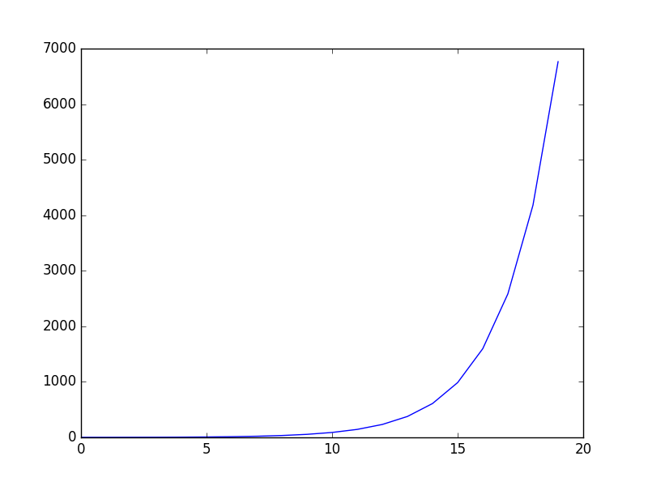

# Fibonacci-series-Module
Fibonacci series with graph representation using python and matplotlib

## Getting Started

These instructions will get idea of the project up and running on your local machine for development and Execution purposes. See deployment for notes on how to deploy the project on a live system.

### Prerequisites

What things you need to install the software and how to install them
```
Python2/Python3
```
* [matplotlib](https://pypi.python.org/pypi/matplotlib) - The Web site matplotlib


### Installing

A step by step have to get a development env running
```
step 1. python2 or python3
step 2. pip install matplotlib

```

## Running the Script
```
Enter terminal or console windows/Linux/mac.  

Like : python filename.py       

Example : python Fibonacci.py
```
# How it works
```
After Execution 
It Will ask you "Enter how many fibina number :"
enter number like 20
You will get output 20 Fibonacci numbers:
```
# output
[1, 1, 2, 3, 5, 8, 13, 21, 34, 55, 89, 144, 233, 377, 610, 987, 1597, 2584, 4181, 6765]



## Authors

* **Niranjan Kumar G S** - *Complete work* - [Guithub](https://github.com/niranjangs4)
* **Email : niranjan4@outlook.in**


